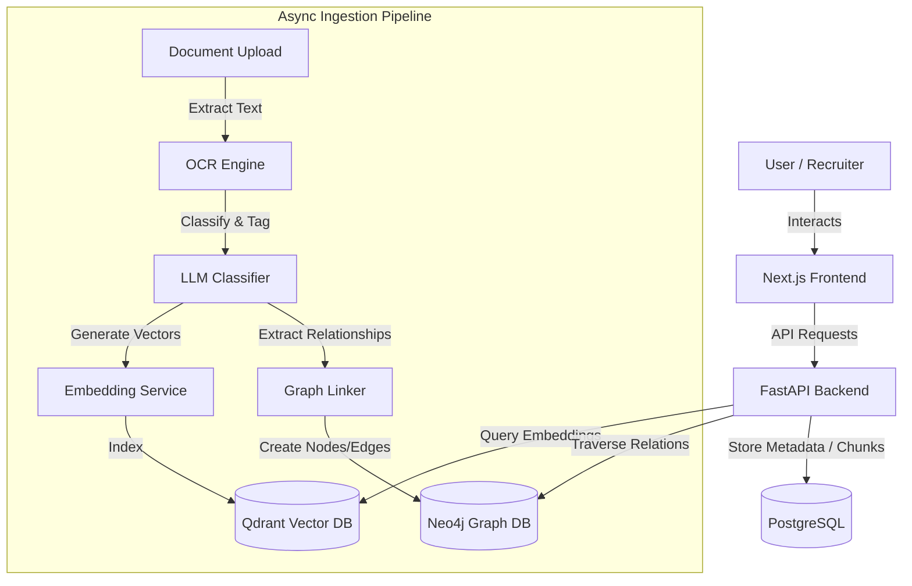

# IdentityOS 🚀

An AI-powered Digital Identity Operating System that understands, validates, and connects a user's professional journey, turning folders of unorganized documents into a queryable, structured knowledge graph and recruiter-ready verified portfolio.

---

## 📖 Project Vision & Problem Statement

### The Problem
Traditional portfolios, CVs, and document drives are static, fragmented, and unverified. Resumes are filled with self-proclaimed skills, certificates are buried in email folders, and project context is lost across deep directory paths. Recruiters spend hours verifying credentials, while individuals struggle to show the cohesive narrative of their career evolution.

### The Solution: IdentityOS
**IdentityOS** is a cognitive environment that ingests, parses (via OCR), categorizes, indexes, and links all facets of an academic and professional journey. 
> "You'll never have to search through folders again. IdentityOS already understands your journey."

---

## ⚡ Key Features

1. **Intelligent Ingestion Pipeline**: Asynchronous OCR text extraction, chunking, and metadata parsing.
2. **AI Categorization**: Automatically classifies documents into 7 core types (Resume, Certificate, Project, Academic, Identification, Recommendation, Experience).
3. **Multi-dimensional Graph Mapping**: Discovers implicit connections (e.g. Skill $\to$ Project, Certificate $\to$ Internship) and projects them into a Neo4j Knowledge Graph.
4. **Verified Dossier Portfolio**: An exportable (JSON/CSV) and print-optimized recruiter presentation layout with zero-control view security.
5. **Grounded AI Copilot**: High-fidelity RAG-powered chatbot with direct document source citations and confidence scores.
6. **Career Twin & Predictive Engine**: Infers overall role trends, maps career directions, and recommends target steps.
7. **Identity Verification & Scoring**: Compiles a real-time credibility metric based on verified evidence count, cross-linking density, and document validity.

---

## 🛠️ Technology Stack

| Layer | Technology | Purpose |
|---|---|---|
| **Frontend** | Next.js 14, React 18, TypeScript, TailwindCSS, ReactFlow, Framer Motion | HUD workspace interface, graph rendering, and presentation modes. |
| **Backend** | FastAPI (Python 3.11+), SQLAlchemy | High-performance async REST API and background task worker. |
| **Relational DB** | PostgreSQL | Source of truth for documents, extracted text chunks, and metadata. |
| **Vector DB** | Qdrant | Dense vector search indexing (`bge-large-en-v1.5` embeddings) for semantic search. |
| **Graph DB** | Neo4j | Graph-relational storage for discovered skills, credentials, and timeline edges. |

---

## 🧩 System Architecture



---

## 🗄️ Database Responsibilities

To avoid synchronization issues and text duplication, the responsibilities are strictly separated:
- **PostgreSQL**: Stores structured metadata, user credentials, document statuses, raw text chunks, and parsed timeline events.
- **Qdrant**: Stores high-dimensional text embeddings. Holds only a pointer reference (`document_chunk_id`) to Postgres to perform semantic search, ensuring zero text redundancy.
- **Neo4j**: Manages entities (Nodes: `Skill`, `Project`, `Certificate`, etc.) and their relationships (Edges: `HAS_SKILL`, `VERIFIED_BY`). Nodes carry minimal IDs; detailed text is fetched on-demand from Postgres.

---

## 📁 Directory Structure

```
digital-identity-system/
├── apps/
│   ├── api/                   # Python FastAPI Backend
│   │   ├── core/              # Config, Security, and App Constants
│   │   ├── db/                # Postgres, Qdrant, and Neo4j Connections
│   │   ├── models/            # SQLAlchemy database models
│   │   ├── routers/           # REST endpoint controllers (auth, chat, dashboard, etc.)
│   │   ├── services/          # OCR, LLM, Embedding, Graph, RAG, and Timeline services
│   │   ├── uploads/           # Temporary local storage for uploads
│   │   ├── workers/           # Asynchronous ingestion tasks
│   │   └── main.py            # API entrypoint
│   └── web/                   # Next.js Frontend
│       ├── app/               # Next.js App Router views (dashboard, graph, chat, etc.)
│       ├── components/        # Reusable UI widgets (AppShell, HudFrame, Sidebar, etc.)
│       ├── lib/               # API clients, axios configurations
│       └── package.json
├── docker-compose.yml         # Local database orchestration configurations
└── README.md
```

---

## 🚀 Getting Started

### 1. Prerequisite Infrastructure
Bring up the relational database, vector database, and graph database using Docker:
```bash
docker compose up -d
```
*Port mappings:*
- PostgreSQL: `localhost:5432`
- Qdrant: `localhost:6333`
- Neo4j: `localhost:7474` (web browser UI) / `localhost:7687` (bolt connection)

### 2. Backend Setup
```bash
cd apps/api
python -m venv venv
# Linux/macOS
source venv/bin/activate
# Windows
.\venv\Scripts\activate

pip install -r requirements.txt
cp .env.example .env # Update with LLM provider keys and configuration overrides
uvicorn main:app --reload --port 8000
```
Verify backend is online: `curl http://localhost:8000/health` $\to$ `{"status": "ok"}`

### 3. Frontend Setup
```bash
cd apps/web
npm install
cp .env.local.example .env.local
npm run dev
```
Open `http://localhost:3000` in your web browser.

---

## 🔑 Demo & Verification Credentials

IdentityOS has a built-in **Demo Mode Preset** toggle in the sidebar. This allows you to run and showcase the entire document processing cycle immediately.

- **Username**: `demo@identityos.local`
- **Password**: `demo1234`
*(If using custom database configurations, sign up/login will auto-provision a fresh demo environment).*

---

## 📡 Core API Endpoints

- `POST /auth/login` - Local authentication & session creation.
- `POST /documents/upload` - Ingests document file, triggers async OCR extraction.
- `GET /documents` - List uploaded files and current processing statuses.
- `POST /search` - Semantic search across vectorized document chunks.
- `POST /chat` - Grounded RAG conversational AI.
- `GET /graph` - Returns Neo4j nodes and edges for ReactFlow visualization.
- `GET /timeline` - Returns chronologically ordered milestone objects.
- `GET /dashboard/metrics` - Fetch career trends, profile summary, and credibility scores.

---

## 🔮 Future Roadmap

- **Federated Verification**: Cryptographic signing of credential verification paths.
- **Cross-User Graph Linkages**: Network mappings across teams and companies to discover optimal project pairings.
- **Multimodal Extraction**: Direct parsing of video credentials and project walkthrough clips.

---

## 📖 Hackathon Story

IdentityOS was conceived in a 48-hour sprint to solve the "lost folders" problem of academic and career credential management. We wanted to move beyond raw storage systems and build a cognitive, AI-native workspace. By orchestrating Postgres (facts), Qdrant (vectors), and Neo4j (graph relations), we proved that an AI agent could dynamically parse unstructured CVs/certificates, verify credentials completeness, and map out career trends in real-time.

---

## 🎭 Final Demo Script (5-Minute Walkthrough)

### 1. Landing Page (0:00 - 0:45)
- **Visuals**: Futuristic developer HUD theme with Aurora flow orbs.
- **Narrative**: Explain the core thesis: "You'll never have to search through folders again. IdentityOS already understands your journey." Highlight the key stack (Next.js, FastAPI, Postgres, Qdrant, Neo4j).

### 2. Login & Demo Mode Preset (0:45 - 1:15)
- **Actions**: Click **⚡ Explore Demo Preset** on the landing page or login view to instantly bypass signup.
- **Visuals**: Instantly loads pre-populated portfolio projects, AWS certifications, and internship records.

### 3. Ingestion & AI Processing (1:15 - 2:00)
- **Actions**: Upload a mock CV or certification.
- **Visuals**: Watch the HUD compilation overlay cycle: "Analyzing Relationships...", "Knowledge Graph Synchronized", "Career Twin Updated", "Timeline Refreshed".

### 4. Interactive Dashboard (2:00 - 2:45)
- **Visuals**: AI Narrative Synoptic Box, capability score dial, emerging technical trend vectors, and document quality indicators.
- **Narrative**: Discuss how the Daily AI Briefing updates dynamically based on the uploaded certificates.

### 5. Living Knowledge Graph & Timeline (2:45 - 3:45)
- **Visuals**: Hover over nodes to see connected paths glow; select nodes to view matching metrics and reasoning details. Scroll the timeline to see chronologically ordered career achievements.

### 6. Recruiter Presentation Mode & Export (3:45 - 5:00)
- **Actions**: Toggle presentation mode in the sidebar, open the printable view, export a JSON/CSV dossier of credentials.
- **Statement**: Conclude with: *"IdentityOS doesn't simply organize files. It understands, connects, explains, predicts, and evolves your entire digital journey."*
