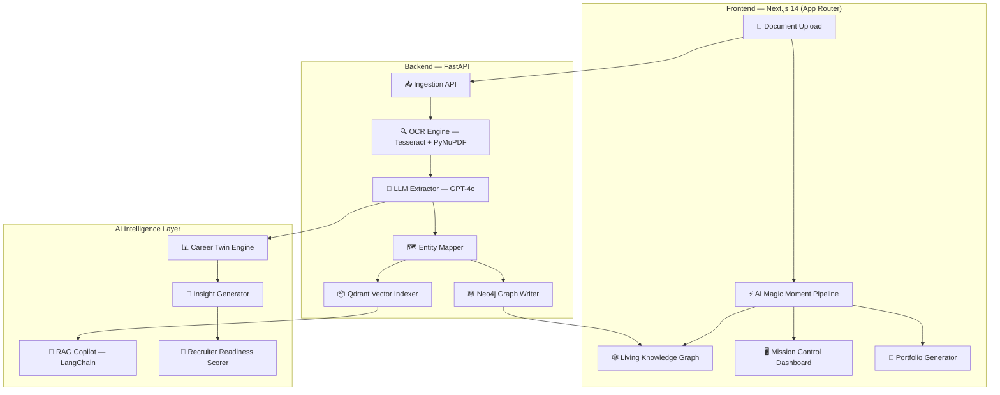

<div align="center">
  <h1>⚡ IdentityOS</h1>
  <p><strong>The AI Digital Identity Operating System</strong></p>
  <p>
    <em>Transform your professional credentials into a living, AI-powered knowledge graph that recruiters, advisors, and hiring managers instantly understand.</em>
  </p>
  <br/>
  
  
  
  
  
</div>

---

## 🧠 The Problem

Your professional identity is scattered across **dozens of PDFs, certificates, transcripts, and project docs** — and recruiters have **30 seconds** to evaluate you.

Traditional resumes are static, unverifiable, and context-free. ATS systems strip out your nuance. LinkedIn is a popularity contest.

**IdentityOS fixes all of this.**

---

## ✦ The Solution

IdentityOS is an AI-native platform that:

1. **Ingests any document** — resume, cert, transcript, project report, offer letter
2. **Extracts entities** using OCR + GPT-4o (skills, dates, roles, organizations, achievements)
3. **Builds a Living Knowledge Graph** connecting everything with confidence-scored relationships
4. **Constructs a Career Twin** — a dynamic AI persona synthesized from verified data
5. **Generates AI Insights** — career gaps, salary predictions, recruiter readiness score
6. **Exports a shareable portfolio** — one link, fully recruiter-ready

---

## 🏗️ Architecture



---

## 🌟 Feature Map

| Feature | Description | Tech |
|---|---|---|
| **Boot Experience** | Cinematic OS boot sequence at `/os/boot` | Framer Motion, Canvas API |
| **Mission Control** | Full command center with 6 live widgets | React, SVG Charts |
| **AI Magic Moment** | 8-step document analysis pipeline overlay | Framer Motion |
| **Knowledge Graph V4** | Live ReactFlow graph with 40+ nodes, 250 relationships | ReactFlow, Neo4j |
| **Career Twin Engine** | Dynamic AI professional persona | GPT-4o, LangChain |
| **Demo Story Mode** | 8-step guided presentation for recruiters | Custom controller |
| **AI Discovery Toasts** | Real-time AI insight notifications | Event emitter + AnimatePresence |
| **Skill Radar** | Animated SVG spider chart for top 6 skills | SVG, Framer Motion |
| **Identity Ring** | Dual-arc SVG completeness gauge | SVG animations |
| **Recruiter Gauge** | Half-circle readiness meter | SVG needle animation |
| **Learning Velocity** | Area chart for skill acquisition rate | SVG path animation |
| **AI Copilot** | Context-aware RAG-powered career assistant | LangChain, Qdrant |
| **Explainability Center** | Full citation trail for every AI insight | Custom chain |
| **Portfolio Export** | Shareable public profile page | Next.js SSG |
| **Presentation Mode** | Clean recruiter-facing view, no dev UI | localStorage flags |
| **Demo Dataset V2** | 30 docs, 40 nodes, 250 edges pre-seeded | Local mock layer |

---

## 🚀 Quick Start

### Prerequisites

- Node.js 18+, Python 3.11+, Docker (optional)

### 1. Clone & Install

```bash
git clone https://github.com/your-org/identityos
cd identityos

# Frontend
cd apps/web && npm install

# Backend
cd ../../backend && pip install -r requirements.txt
```

### 2. Environment Variables

```bash
# apps/web/.env.local
NEXT_PUBLIC_API_URL=http://localhost:8000
NEXT_PUBLIC_SUPABASE_URL=your_supabase_url
NEXT_PUBLIC_SUPABASE_ANON_KEY=your_supabase_anon_key

# backend/.env
OPENAI_API_KEY=sk-...
NEO4J_URI=bolt://localhost:7687
NEO4J_PASSWORD=your_password
QDRANT_URL=http://localhost:6333
```

### 3. Run Development Servers

```bash
# Terminal 1 — Frontend
cd apps/web && npm run dev       # → http://localhost:3000

# Terminal 2 — Backend
cd backend && uvicorn main:app --reload  # → http://localhost:8000
```

### 4. Try Demo Mode

Visit `http://localhost:3000` → click **"Explore Demo Dataset"** to instantly load 30 documents, 250 relationships, and a full Career Twin with zero backend required.

Or navigate directly to **`/os/boot`** for the cinematic boot experience.

---

## 🎬 Demo Flow (For Judges)

> Use this sequence for a 4-minute live demo:

| Step | Action | Shows |
|---|---|---|
| 1 | Open `/os/boot` | Cinematic OS boot, neural mesh background |
| 2 | Auto-redirect → `/dashboard` | Mission Control: Identity Ring 94%, Career Twin, Recruiter Gauge 96% |
| 3 | Click **"Start Presentation"** in sidebar | Demo Story Mode activates with 8-step guide |
| 4 | Upload any PDF | AI Magic Moment: 8-step analysis pipeline + AI Copilot speech bubbles |
| 5 | Navigate to `/graph` | Living Knowledge Graph: 40 nodes, hover to see confidence + reasoning |
| 6 | Navigate to `/timeline` | 12-event chronological career journey |
| 7 | Navigate to `/explainability` | Every AI insight grounded in real document citations |
| 8 | Navigate to `/portfolio` | One shareable recruiter-ready link |

---

## 🛠️ Tech Stack

### Frontend
| Layer | Technology |
|---|---|
| Framework | Next.js 14 (App Router) |
| Animations | Framer Motion 11 |
| Graph Viz | ReactFlow 11 |
| Styling | Tailwind CSS v3 |
| Charts | Custom SVG (zero dependencies) |
| State | React useState + localStorage |
| Fonts | Space Grotesk · Inter · JetBrains Mono |

### Backend
| Layer | Technology |
|---|---|
| API | FastAPI + Uvicorn |
| OCR | Tesseract + PyMuPDF |
| AI Extraction | OpenAI GPT-4o |
| Graph DB | Neo4j 5 |
| Vector DB | Qdrant |
| AI Pipeline | LangChain |
| Auth | Supabase |

---

## 📐 Design System

IdentityOS uses a custom dark-mode design system:

```
void:         #07090F   — Background
panel:        #11151C   — Surface
panel-raised: #191F2A   — Elevated surface
cyan:         #4F8CFF   — Primary action
magenta:      #7B61FF   — Secondary / AI
amber:        #F59E0B   — Warning / Prediction
fog:          #F8FAFC   — Primary text
mist:         #94A3B8   — Secondary text
```

Visual references: Apple VisionOS · Linear · Vercel · Arc Browser · Figma

---

## 📁 Project Structure

```
identityos/
├── apps/
│   └── web/                    # Next.js 14 frontend
│       ├── app/
│       │   ├── os/boot/        # ⚡ Cinematic boot sequence
│       │   ├── dashboard/      # 🖥️ Mission Control V2
│       │   ├── graph/          # 🕸️ Knowledge Graph V4
│       │   ├── timeline/       # ⏳ Career Timeline
│       │   ├── chat/           # 💬 AI Copilot
│       │   ├── portfolio/      # 💼 Public portfolio
│       │   ├── auditors/       # 🔍 AI Auditors
│       │   ├── evolution/      # 📈 Career Twin
│       │   └── explainability/ # 🧠 AI Explainability
│       ├── components/
│       │   ├── AILoader.tsx         # Neural mesh AI loading state
│       │   ├── AIDiscoveryToast.tsx # Floating AI insight toasts
│       │   ├── DemoStoryMode.tsx    # 8-step guided presentation
│       │   ├── UploadControl.tsx    # AI Magic Moment pipeline
│       │   ├── charts/
│       │   │   ├── IdentityRing.tsx
│       │   │   ├── SkillRadar.tsx
│       │   │   ├── GrowthTimeline.tsx
│       │   │   └── RecruiterGauge.tsx
│       │   ├── Sidebar.tsx
│       │   ├── AppShell.tsx
│       │   └── CopilotPanel.tsx
│       └── lib/
│           ├── api-client.ts       # API + Demo Dataset V2 (30 docs, 250 rels)
│           └── discovery-store.ts  # Global AI toast event emitter
└── backend/                    # FastAPI backend
    ├── main.py
    ├── routers/
    └── services/
```

---

## 🗺️ Roadmap

- [x] Phase 1–11: Core platform, AI pipelines, graph engine, copilot
- [x] **Phase 12**: Grand Finale — Boot experience, Magic Moment, Dashboard V2, Graph V4, Story Mode
- [ ] Phase 13: Mobile app (React Native) with document camera
- [ ] Phase 14: Multi-user teams — shared credential vaults
- [ ] Phase 15: Enterprise API — HR system integrations
- [ ] Phase 16: Blockchain credential anchoring (ERC-721 NFT certs)

---

## 🏆 Built For

**National AI Hackathon 2026** — Category: AI for Human Empowerment

> *"When judges finish the demo, they should feel like they have seen the future of digital identity management."*

---

<div align="center">
  <p>Built with ❤️ and <strong>too much coffee</strong></p>
  <p><strong>IdentityOS</strong> — Your identity, understood by machines, trusted by humans.</p>
</div>
